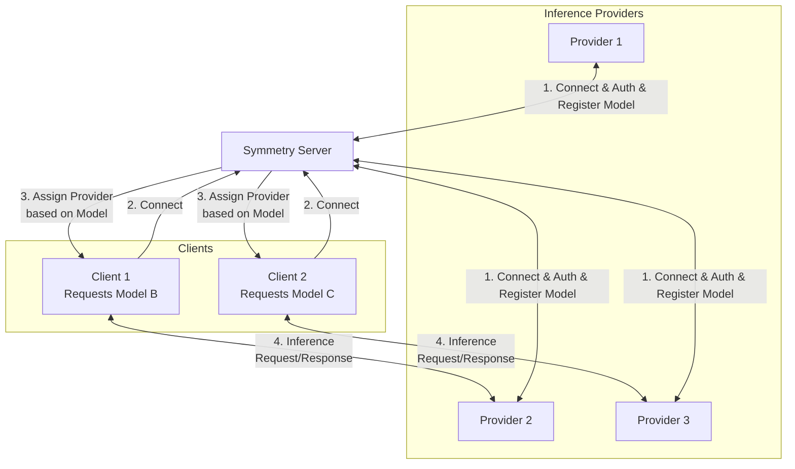

# Symmetry

Use this repository to become an inference provider on the Symmetry network.

Symmetry is a decentralized peer-to-peer network tool that allows users to share computational resources for AI inference. It enables users to connect directly and securely with each other, offering or seeking computational power for various AI tasks.

## Features

- Decentralized peer-to-peer network
- YAML-based configuration
- Privacy options
- Optional data collection for providers
- Compatible with various AI inference providers

## Installation

To install Symmetry, use the following commands:

For Linux and macOS:
```bash
curl -fsSL https://raw.githubusercontent.com/twinnydotdev/symmetry/master/install.sh | sh
```

For Windows:
```powershell
iwr -useb https://raw.githubusercontent.com/twinnydotdev/symmetry/master/install.ps1 | iex
```

## Usage

To start Symmetry, run:

```bash
symmetry-cli
```

By default, Symmetry looks for its configuration file at `~/.config/symmetry/provider.yaml`. To use a different configuration file, use:

```bash
symmetry-cli -c /path/to/your/provider.yaml
```

## Configuration

Here's an example `provider.yaml` configuration:

```yaml
apiHostname: localhost  # The hostname of the API server.
apiKey:  # The API key for authentication.
apiPath: /v1/chat/completions  # The endpoint path for chat completions.
apiPort: 11434  # The port number on which the API server is listening.
apiProtocol: http  # The protocol used to communicate with the API server.
apiProvider: ollama  # The name of the API provider.
dataCollectionEnabled: false  # Whether to enable data collection.
maxConnections: 10  # The maximum number of connections.
modelName: llama3.1:latest  # The name and version of the AI model to use.
name: twinnydotdev  # Your chosen name as a provider on the Symmetry network.
path: /home/twinnydotdev/.config/symmetry/data  # The local path where Symmetry will store its configuration and data files.
public: true  # Whether this provider is publicly accessible on the Symmetry network.
serverKey: 4b4a9cc325d134dee6679e9407420023531fd7e96c563f6c5d00fd5549b77435  # The unique key for connecting to the Symmetry server.
```

Adjust these settings according to your preferences and setup.

## Architecture



## Development

To set up Symmetry for development:

1. Clone the repository:
   ```bash
   git clone https://github.com/twinnydotdev/symmetry.git
   cd symmetry
   ```

2. Install dependencies:
   ```bash
   npm install
   ```

3. Build the project:
   ```bash
   npm run build
   ```

4. Start the development server:
   ```bash
   npm run dev
   ```

## Contributing

Contributions are welcome! Please submit your pull requests to the [GitHub repository](https://github.com/twinnydotdev/symmetry/pulls).

## License

This project is licensed under the [MIT License](https://github.com/twinnydotdev/symmetry/blob/main/LICENSE).

## Support

If you encounter any issues or have questions, please [open an issue](https://github.com/twinnydotdev/symmetry/issues) on GitHub.

## Acknowledgments

We thank [Hyperswarm](https://github.com/holepunchto/hyperswarm) for providing the underlying peer-to-peer networking capabilities.
```

This markdown version provides a clean, professional, and easily readable README for the Symmetry project.
