#  Symmetry

In the vast lands of the Internet, where bits and bytes flow like the rivers of old, there arose a tool of great power and purpose. Symmetry the enchanted mirror. With Symmetry, users of the digital realm could offer their computational strength to others, allowing seekers of knowledge to tap into the wisdom of distant machines.

## Features

- **Network**: A decentralized network, of interconnected peers.
- **Configuration**: A scroll of YAML, easily inscribed to bend Symmetry to one's will.
- **Privacy**: A choice between openness and secrecy.
- **Data collection**: An option to gather tales of interactions, should the provider wish it so.

## Installation

To call forth Symmetry into your realm, speak these words of power:

Linux and MacOs
```
curl -fsSL https://raw.githubusercontent.com/twinnydotdev/symmetry/master/install.sh | sh
```

Windows
```
iwr -useb https://raw.githubusercontent.com/twinnydotdev/symmetry/master/install.ps1 | iex
```

## Usage

To awaken Symmetry, utter this command:

```
symmetry-cli
```

Symmetry will seek its tome of knowledge in the halls of `~/.config/symmetry/provider.yaml`. Should you wish to direct it to another scroll, speak thus:

```
symmetry-cli -c /path/to/your/sacred/provider.yaml
```

## Configuration

Inscribe your `provider.yaml` with these mystical runes:

```yaml
apiHostname: localhost # The dwelling of your local oracle
apiKey: # The secret word to commune with your oracle
apiPath: /v1/chat/completions # The path to wisdom
apiPort: 11434 # The gate through which knowledge flows
apiProtocol: http # The method of communion
apiProvider: ollama # The lineage of your oracle
dataCollectionEnabled: true # Whether to gather lore
maxConnections: 10 # The limit of simultaneous seekers
modelName: llama3:8b # The true name of your oracle
name: twinnydotdev # Your title in this realm
path: /home/richard/.config/symmetry/default # The dwelling for data
public: true # Whether your services are open to all
serverKey: 4b4a9cc325d134dee6679e9407420023531fd7e96c563f6c5d00fd5549b77435 # The key of the central tower
```

Adjust these runes to align with your own preferences.

## Architecture

```mermaid
graph TB
    S[Symmetry Server]
    
    subgraph "Inference Providers"
        P1[Provider 1]
        P2[Provider 2]
        P3[Provider 3]
    end
    
    subgraph "Clients"
        C1[Client 1<br/>Requests Model B]
        C2[Client 2<br/>Requests Model C]
    end
    
    P1 <--> |"1. Connect & Auth & Register Model"| S
    P2 <--> |"1. Connect & Auth & Register Model"| S
    P3 <--> |"1. Connect & Auth & Register Model"| S
    
    C1 -- "2. Connect" --> S
    C2 -- "2. Connect" --> S
    
    S -- "3. Assign Provider<br/>based on Model" --> C1
    S -- "3. Assign Provider<br/>based on Model" --> C2
    
    C1 <--> |"4. Inference<br/>Request/Response"| P2
    C2 <--> |"4. Inference<br/>Request/Response"| P3

    style S fill:#ff9900,stroke:#333,stroke-width:4px
    style P1 fill:#00ccff,stroke:#333,stroke-width:2px
    style P2 fill:#00ccff,stroke:#333,stroke-width:2px
    style P3 fill:#00ccff,stroke:#333,stroke-width:2px
    style C1 fill:#333,stroke:#fff,stroke-width:2px
    style C2 fill:#333,stroke:#fff,stroke-width:2px
```



### Server, Providers and Clients:
- **Central Server**: Symmetry Server, a beacon of order in the chaotic digital winds.
- **Providers**: Inference Providers, keepers of knowledge and computational might.
- **Client**: Clients, adventurers in search of answers from the oracles of data.

### Connection:

1. The Providers approach the Central Tower, proving their worth and declaring their specialties.
2. Seekers call out to the Tower, their questions echoing in the digital void.
3. The Tower, in its wisdom, guides each Seeker to a suitable Provider.
4. Seeker and Provider join in a dance of query and response, their connection direct and true.

### Communication:

- All messages between Seekers and Providers are cloaked in unbreakable encryption, safe from prying eyes.
- The Providers may choose to remember the tales told to them, a choice they must declare openly.
- Seekers are granted the wisdom to choose their Providers based on these declarations of memory.

### Features:

- **Adaptability**: As changeable as the seasons, ready for new knowledge and new seekers.
- **Swiftness**: Direct connections ensure that wisdom flows like the rapids of a mountain stream.
- **Guardianship**: Only the worthy may enter this circle of trust.
- **Balance**: The Tower ensures no single Provider bears too heavy a burden.
- **Growth**: New Providers may join the circle, expanding the realm of possibility.

Thus does Symmetry weave its web of connections, bringing together the seekers and keepers of digital wisdom in a grand tapestry of knowledge and computation.

## Forging of Symmetry

For those who wish to shape Symmetry with their own hands:

1. Summon the essence:
   ```
   git clone https://github.com/twinnydotdev/symmetry.git
   cd symmetry
   ```

2. Gather the necessary elements:
   ```
   npm install
   ```

3. Forge the tool:
   ```
   npm run build
   ```

4. Awaken:
   ```
   npm start
   ```

## Call for Heroes

Brave souls willing to improve upon this grand design are most welcome. Present your [scrolls of change](https://github.com/twinnydotdev/symmetry/pulls) for consideration.

## Covenant

This work is protected under the [Oath of MIT](https://github.com/twinnydotdev/symmetry/blob/main/LICENSE), a sacred bond between creator and user.

## Council of Elders

Should you face trials or seek guidance, bring your [queries](https://github.com/twinnydotdev/symmetry/issues) before the Council on GitHub.

## A Nod to the Ancients

We pay homage to [Hyperswarm](https://github.com/holepunchto/hyperswarm), the tool that makes our connections possible.
